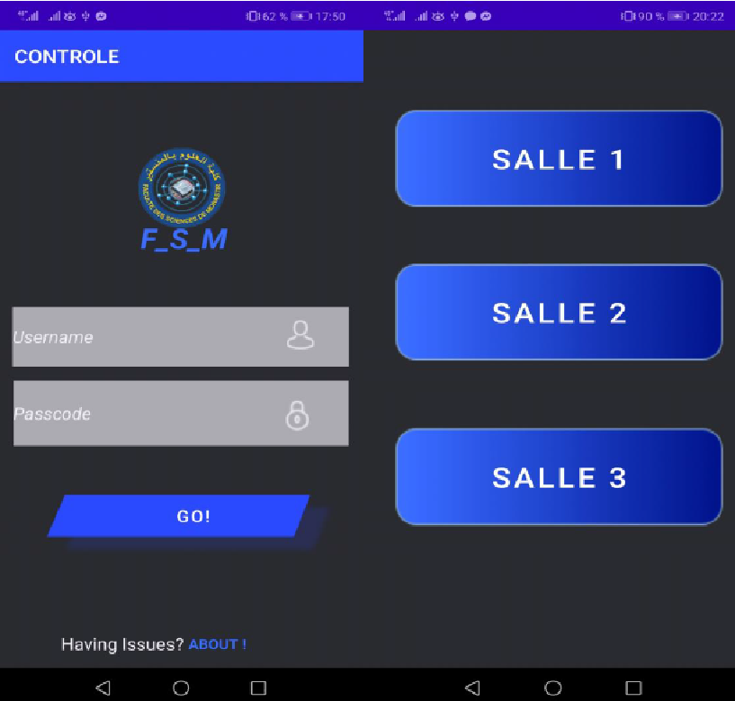

# IoT-Monitoring-Project  
**IoT System for Status Monitoring via Android Application**

## 📖 Project Description
This project is a **real-time IoT monitoring system** that uses an ESP32 board integrated with various sensors to monitor system parameters. Data is sent to an **Android application** where it is displayed for easy, on-the-go monitoring.

## 🚀 Features
- **Real-Time Data Monitoring**: Access system status data on your Android device as it updates in real time.
- **Sensor Integration**: Uses an ESP32 board connected to sensors like temperature, humidity, etc., to collect and transmit data.
- **User-Friendly Interface**: Android application designed for intuitive data visualization and easy navigation.
- **Custom Alerts**: Configure alerts based on threshold values to stay informed about any critical changes (if applicable).

## 🛠️ Tech Stack
- **Hardware**: ESP32 microcontroller, sensors (e.g., temperature, humidity)
- **Android Development**: Java
- **Communication Protocol**: MQTT or HTTP (based on your setup)
- **Backend**: Firebase (if used for data storage or notifications)

## ⚙️ Setup and Installation

### Prerequisites
- ESP32 microcontroller and compatible sensors
- Android Studio (for building the Android app)
- Firebase account (if using Firebase for backend services)
- MQTT broker (if using MQTT for communication)

### Steps
1. **ESP32 Setup**:
   - Connect the sensors to the ESP32.
   - Flash the ESP32 with the provided code in the `ESP32_Code` directory.
   
2. **Android App Setup**:
   - Clone this repository:  
     ```bash
     git clone https://github.com/Amir0055/IoT-Monitoring-Project.git
     ```
   - Open the project in Android Studio.
   - Configure Firebase or MQTT settings as needed in the code.
   - Build and run the app on an Android device or emulator.

3. **Run and Test**:
   - Power on the ESP32 and ensure it is connected to Wi-Fi.
   - Open the Android app, and you should start seeing data from the ESP32 sensors in real-time.

## 📂 Project Structure
- **ESP32_Code/**: Contains the code to set up and run on the ESP32.
- **Android_App/**: The Android app source code.
- **README.md**: Project overview and instructions.

## 📷 Screenshots
<!-- Add screenshots of your Android app or data visualization screens here -->


## 📝 License
This project is licensed under the MIT License - see the [LICENSE](LICENSE) file for details.
